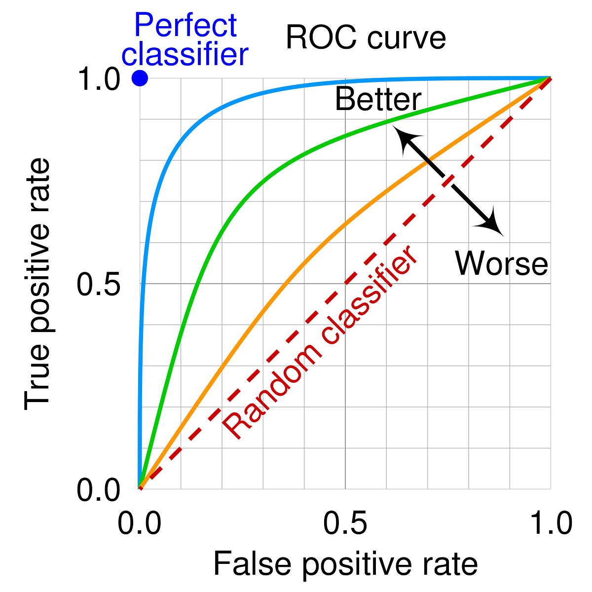

# 2주차 Porto Seguro’s Safe Driver Prediction 캐글 필사

## 참고 노트북

[Porto Seguro Tutorial: end-to-end ensemble - Yifan Xie](https://www.kaggle.com/code/yifanxie/porto-seguro-tutorial-end-to-end-ensemble#4.-Level-2-ensemble)


## 내용 정리

### 이진 인코딩

| 값 (원본)        | 이진수 | ps_car_04_cat_bin_0 | ps_car_04_cat_bin_1 | ps_car_04_cat_bin_2 |
|------------------|--------|----------------------|----------------------|----------------------|
| **0**            | 000    | 0                    | 0                    | 0                    |
| **1**            | 001    | 0                    | 0                    | 1                    |
| **2**            | 010    | 0                    | 1                    | 0                    |
| **3**            | 011    | 0                    | 1                    | 1                    |
| **5 *(원래 -1)***| 101    | 1                    | 0                    | 1                    |

---
#### 이진 인코딩을 사용하는 이유

> **범주형 데이터를 수치형으로 변환 가능**
> - 머신러닝 모델이 텍스트 데이터는 이해하지 못하므로 숫자로 바꿔야 함
>
> **고차원 문제(차원의 저주)를 줄일 수 있음**
> - One-hot 인코딩은 범주가 많을수록 열이 많아짐
> - Binary 인코딩은 log₂(N) 개의 열만 필요 (N: 범주 수)
>
> **트리 기반 모델과 잘 맞음**
> - Random Forest, LightGBM, XGBoost 등에서 효과적
>
> **순서 없는 명목형 변수에도 적합**
> - 범주의 순서를 고려하지 않기 때문에 순서가 중요하지 않은 데이터에 적절


<br>

### 분류 모델 평가지표 

**AUC (Area Under the Curve)**<br>
=> **ROC (Receiver Operating Characteristic)** Curve 아래의 면적을 말하며, 모델이 **임의로 고른 양성 샘플과 음성 샘플을 올바르게 구분할 확률**을 의미함



---
**Gini Coefficient**<br>
=> Gini 계수는 분포의 **불균형 정도**를 측정하는 지표로, 분류 문제에서는 AUC에서 파생된 지표로 사용되며, **모델이 양성과 음성을 분리할 수 있는 능력**을 나타냄


<br>

### OOF(Out-of-Fold) 예측이란?

모델이 훈련에 사용되지 않은 데이터(Fold)에서 예측한 값을 모아 전체 훈련 데이터에 대한 예측값을 구성하는 것<br>
**→ 과적합 방지 + 메타 모델 학습 가능**

#### 비유로 설명하자면...
>
> **시험 문제를 미리 알고 푼 것** = 높은 점수지만 실제 실력 아님
>
> OOF = **시험 문제를 처음 본 상태에서 푼 결과**<br>
> → 진짜 실력을 반영<br>
> → 진짜 실력 기반으로 다음 단계를 준비 가능 (메타 모델 학습)

<br>

### 스태킹(Stacking)이란?

스태킹은 여러 개의 개별 모델들을 학습시킨 후, 그들의 예측 결과를 새로운 데이터로 삼아 **메타 모델**을 훈련시키는 방법

- **개별 모델들:** 서로 다른 알고리즘을 사용하는 다양한 모델
- **메타 모델:** 개별 모델들의 예측 결과를 입력으로 받아 최종 예측을 수행하는 모델


---
### 본 노트북에서의 스태킹 흐름

- **Level 1:** 다양한 개별 모델(Base Models)들의 예측 결과 생성 (OOF 방식)
- **Level 2:** Level 1 결과를 입력으로 받아 또 다른 모델을 학습 (Meta-Model)
- **Level 3:** Level 2 결과를 다시 입력으로 하여 최종 예측 모델 학습

#### ✅ Level 1: Base Models & OOF 예측 생성

**주요 모델**
- Random Forest
- Extra Trees
- Logistic Regression
- Bernoulli Naive Bayes
- XGBoost
- LightGBM

**핵심: OOF(Out-of-Fold) 예측**
- StratifiedKFold로 훈련 데이터를 K개로 나눔
- 각 모델은 K개의 폴드로 나눠 학습 및 검증
- 검증에 사용되지 않은 Fold로 예측값을 생성 → train_pred
- 테스트셋은 각 Fold에서 예측한 결과의 평균 → test_pred
```PYTHON
rf_train_pred, rf_test_pred = cross_validate_sklearn(rf, x_train, y_train, x_test, kf)
```
=> 이러한 방식으로 각 모델별로 예측값을 DataFrame으로 저장

---
#### ✅ Level 2: 메타 모델 학습

**Level 1 예측 결과들을 Feature로 구성**
```PYTHON
rf_train_pred, rf_test_pred = cross_validate_sklearn(rf, x_train, y_train, x_test, kf)
```

**Level 2 메타 모델**
- Cross-validation을 통해 다시 OOF 예측 수행
- 이 때 AUC 기반 예측이기 때문에 rank를 사용하는 것이 성능 향상에 도움이 됨
```PYTHON
xgb_lv2_outcomes = cross_validate_xgb(xgb_params, lv1_train_df, y_train, lv1_test_df, kf, use_rank=True)
```
=> 이렇게 얻은 결과는 레벨2 예측값이 됨

---
#### ✅ Level 3: 최종 스태킹

**Level 2 결과를 다시 feature로 구성**
```PYTHON
lv2_train = pd.DataFrame({
    'rf_lv2': rf_lv2_train_pred,
    'logit_lv2': logit_lv2_train_pred,
    'xgb_lv2': xgb_lv2_train_pred,
    'lgb_lv2': lgb_lv2_train_pred
})
```

**최종 모델 학습 (XGBoost & Logistic Regression)**
```PYTHON
xgb_lv3_outcomes = cross_validate_xgb(xgb_lv3_params, lv2_train, y_train, lv2_test, kf, use_rank=True)
logit_lv3_outcomes = cross_validate_sklearn(logit_lv3, lv2_train, y_train, lv2_test, kf, scale=True)
```

---
#### ✅ 최종 예측 및 앙상블
- 두 개의 Level 3 모델 예측 결과를 단순 평균으로 앙상블
```PYTHON
submission['target'] = 0.5 * logit_lv3_test_pred + 0.5 * xgb_lv3_test_pred
```

---
#### 📌 핵심 요약

| 단계      | 주요 모델                                | 목적           | 선택 이유 |
|-----------|-------------------------------------------|----------------|-----------|
| **Level 1** | RF, ET, Logit, NB, XGB, LGB               | 다양성 확보    | 서로 다른 패턴을 가진 예측값 생성 |
| **Level 2** | XGB, LGB, RF, Logit                       | 조합 최적화    | OOF 예측을 메타 모델에 넣어 성능 향상 |
| **Level 3** | XGB, Logit                                | 최종 조합      | 강력한 모델과 단순한 모델을 평균 앙상블 |