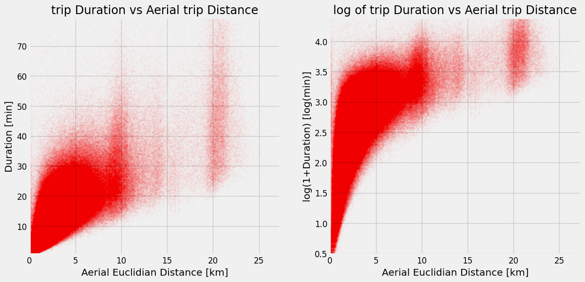
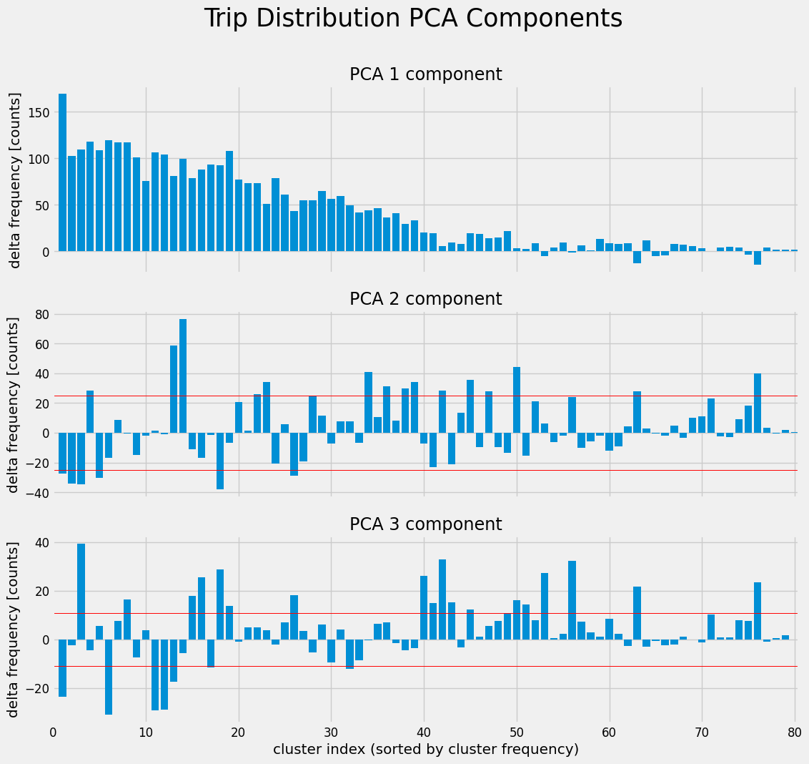

# 3주차 New York City Taxi Trip Duration 캐글 필사

## 참고 노트북

[Yellow Cabs tell The Story of New York City - David Beniaguev](https://www.kaggle.com/code/selfishgene/yellow-cabs-tell-the-story-of-new-york-city)


## 내용 정리

### 유클리디안 거리(Euclidean Distance)

**두 점 사이의 직선 거리**를 의미하며, 우리가 일상에서 생각하는 가장 직관적인 거리 개념

> **n차원 공간에서 두 점**<br>
> $A = (x_1, x_2, \dots, x_n)$<br>
> $B = (y_1, y_2, \dots, y_n)$
>
> **거리 공식**<br>
> $$d(A, B) = \sqrt{(x_1 - y_1)^2 + (x_2 - y_2)^2 + \cdots + (x_n - y_n)^2}$$

---
#### 택시 데이터에서의 활용

=> **픽업 지점과 드롭오프 지점 간의 직선 거리**를 계산<br>
=> 실제 주행 거리는 아니지만, **최소 이동 거리의 기준선**으로 유용<br>
=> 이동 소요 시간과 비교하여 **우회, 정체 등 경로 특성**을 간접적으로 파악 가능



- 유클리디안 거리와 소요 시간은 강한 관계를 가지며, 거리 자체가 **이동 시간의 물리적 최소 한계선**을 만들어냄
- 로그 변환을 통해 데이터 분포의 왜곡을 줄이고, **정규성 가정이나 회귀 모델 성능 향상**에 도움을 줄 수 있음
- 특정 거리 구간에서 나타나는 패턴은 **특정 목적지 클러스터**로 해석될 여지도 있음

<br>

### 주성분 분석(PCA, Principal Component Analysis)

고차원의 데이터를 **가장 정보가 많은 방향**으로 정렬해 **적은 차원으로 요약**하는 기법<br>
데이터의 **분산이 큰 방향**을 기준으로 새로운 축을 만들어, 핵심적인 정보를 **소수의 주성분으로 요약**함

=> **차원 축소**, **패턴 발견**, **시각화**, **모델 최적화**

| 단계 | 설명 |
|------|------|
| **1. 데이터 정규화** | 각 변수의 평균을 0, 표준편차를 1로 맞춤 (스케일링) |
| **2. 공분산 행렬 계산** | 변수 간의 관계(함께 변하는 정도)를 담은 행렬 생성 |
| **3. 고유값 & 고유벡터 계산** | 공분산 행렬을 고유값 분해 → 주성분 방향(고유벡터)과 정보량(고유값) 추출 |
| **4. 주성분 선택** | 가장 많은 정보를 담고 있는 상위 k개의 주성분 선택 |
| **5. 데이터 변환 (투영)** | 원본 데이터를 선택된 주성분 축으로 투영하여 차원 축소된 데이터 생성 |

---
#### 택시 데이터에서의 활용

- 클러스터링된 택시 이동 유형(총 80개)의 **시간별 변화 패턴을 분석**
- 80차원 클러스터 분포를 **3차원으로 축소**하여 **시간 흐름에 따른 특징 변화 시각화**

<br>

**1. 입력 데이터 구성**

```python
clusterDistributionHourOfYear = np.zeros((시간 수, 80))
```

- 매 시간마다 각 클러스터(이동 유형)의 빈도 분포 계산  
- 결과: **[시간 × 80차원] 벡터 행렬** → PCA의 입력 데이터

| 시간대 | 클러스터 0 | 클러스터 1 | 클러스터 2 | ... | 클러스터 79 |
|--------|-------------|-------------|-------------|-----|---------------|
| 00시   | 12회        | 5회         | 40회        | ... | 3회            |
| 01시   | 7회         | 4회         | 30회        | ... | 2회            |
| 02시   | 3회         | 3회         | 20회        | ... | 1회            |

<br>

**2. PCA 수행**

```python
from sklearn import decomposition

numComponents = 3
TripDistributionPCAModel = decomposition.PCA(n_components=numComponents, whiten=True, random_state=1)
compactClusterDistributionHourOfYear = TripDistributionPCAModel.fit_transform(clusterDistributionHourOfYear)
```

- 80차원 클러스터 분포를 **3개의 주성분(PC1, PC2, PC3)** 으로 축소  
- 결과 행렬: **[시간 × 3차원]**

<br>

**3. 주성분 계수의 시간 흐름 시각화**

**주간 흐름**

```python
weeklyTraces = compactClusterDistributionHourOfYear[week 기준 시간대]
```

- **168시간(24×7)** 단위로 PCA 계수 시계열 추적  
- 각 주를 겹쳐 그리며, **평균 곡선도 함께 시각화**

**평일 vs 주말 비교**

```python
weekdayTraces, weekendTraces = ...
```

- PCA 계수의 일간 변화 패턴을 **평일과 주말**로 나누어 비교  
- 대표적 해석:
  - **PC2**: 야간 활동 증가 (ex. 주말 파티)
  - **PC3**: 이른 아침 통근 or 외곽 ↔ 중심지 통행 차이

<br>

**4. 주성분 의미 해석 (클러스터 가중치 시각화)**

```python
TripDistributionPCAModel.components_[i, :] * TripDistributionPCAModel.explained_variance_[i]
```

- 각 **주성분이 어떤 클러스터에 민감하게 반응하는지** 가중치로 시각화  
- **PC1 ~ PC3의 의미를 클러스터 기반으로 해석** 가능

<br>

**5. 지도 위에서 PCA별 대표 경로 시각화**

- **PC2, PC3**에서 가장 크게 기여하는 클러스터를 지도에 시각화  
- 화살표 방향으로 **이동 경로**,  
  색상으로 **출발지(마젠타)** / **도착지(초록)** 구분

```python
sortedTripClusters_PC2 = np.argsort(TripDistributionPCAModel.components_[1,:])
```

---


| 주성분 | 의미                   | 대표적 이동 경로 특징             | 시각화 요소                 |
|--------|------------------------|-----------------------------------|-----------------------------|
| **PC1**    | 전체 이동량(gain)       | 전반적 수요 변화 반영              | 전체 높이                   |
| **PC2**    | 야간 이동 (Party Nights) | 맨해튼 단거리, 심야 시간 급증       | 밤에 빨간 화살표 경로        |
| **PC3**    | 조기 활동 (Early Risers) | 아침 출근 경로 증가                | 오전에 빨간 화살표 경로      |
