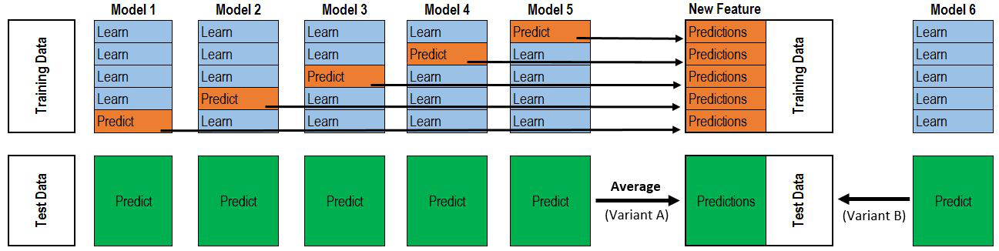

# 4주차 House Prices 캐글 필사

## 참고 노트북

[Stacked Regressions : Top 4% on LeaderBoard - Serigne](https://colab.research.google.com/drive/1DEU0ASEQKTpeE8RjaqiBtf0xdahFW4uB#scrollTo=T7N4rtwL0oNx)

## 내용 정리

### 왜도의 정규화

| 변환 방법     | 수식             | 특징                                      |
|--------------|------------------|-------------------------------------------|
| 로그 변환    | `log(x + 1)`     | 양의 왜도에서 효과적 (`0` 값 처리를 위해 `+1`) |
| 제곱근 변환  | `sqrt(x)`        | 중간 정도의 양의 왜도에서 사용            |
| 역수 변환    | `1 / (x + 1)`    | 극단적 양의 왜도에서 사용                 |
| Box-Cox 변환 | λ 파라미터 기반 변환 | 로그 변환을 포함하는 다양한 형태 적용 가능     |

### Box-Cox 변환이란?

**Box-Cox 변환**은 통계적으로 **왜도**를 줄이기 위한 **파라메트릭 변환 기법**

$$y(\lambda) =
\begin{cases}
\frac{x^\lambda - 1}{\lambda} & \text{if } \lambda \neq 0 \\\\
\log(x) & \text{if } \lambda = 0
\end{cases}$$

- `λ(lambda)` 값에 따라 변환 형태가 달라짐
- λ = 0이면 **로그 변환**과 동일
- 연속적인 양의 값에서만 적용 가능 (x > 0) 
데이터가 0 또는 음수 값을 가질 때 적용하기 어려움 => **여존슨 변환(Yeo-Johnson transformation)** 사용

$$y(\lambda) =
\begin{cases}
\frac{(x + 1)^\lambda - 1}{\lambda}, & \text{if } x \geq 0 \text{ and } \lambda \ne 0 \\\\
\log(x + 1), & \text{if } x \geq 0 \text{ and } \lambda = 0 \\\\
\frac{-((|x| + 1)^{2 - \lambda} - 1)}{2 - \lambda}, & \text{if } x < 0 \text{ and } \lambda \ne 2 \\\\
-\log(|x| + 1), & \text{if } x < 0 \text{ and } \lambda = 2
\end{cases}$$

 

### 회귀 모델

#### Lasso (L1 정규화)
**"짐을 줄여야 할 때, 덜 중요한 걸 과감히 버리는 전략"**

- **무슨 역할?**  
  → 덜 중요한 변수는 아예 `0`으로 만들어 제거
- **장점**:  
  → 자동으로 변수 선택 (불필요한 특성 제거)
- **단점**:  
  → 비슷한 역할을 하는 변수끼리 있을 땐 어느 쪽을 살릴지 **불안정**
- **언제 써?**  
  → 변수는 많은데 진짜 중요한 건 몇 개뿐일 때
- **예시**:  
  → 광고 캠페인 효과 분석: 수백 개 지표 중 몇 개만 실제 영향 줄 때

#### ElasticNet (L1 + L2 정규화)
**"줄일 건 줄이되, 버리진 말고 균형 맞추자"**

- **무슨 역할?**  
  → Lasso처럼 변수 줄이면서도, Ridge처럼 **계수 크기를 안정적으로 유지**
- **장점**:  
  → 변수 간 상관관계 있어도 덜 흔들림
- **단점**:  
  → L1과 L2 비율 조절하는 **하이퍼파라미터 튜닝 필요**
- **언제 써?**  
  → 변수 많고 서로 상관관계도 있을 때
- **예시**:  
  → 유전자 분석: 수천 개 유전자 중 연관 있는 그룹을 함께 고려할 때

#### KRR (Kernel Ridge Regression)
**"직선으로는 설명 안 될 때 곡선으로 그려보자"**

- **무슨 역할?**  
  → 단순한 선형 모델이 아닌, 커널을 써서 **복잡한 곡선 관계**까지 학습
- **장점**:  
  → 비선형 관계도 잘 잡아냄
- **단점**:  
  → 데이터 크면 계산 느림, 튜닝이 중요
- **언제 써?**  
  → 데이터가 복잡하고 선형으로 설명 안 될 때
- **예시**:  
  → 기온 변화에 따른 에너지 사용량 예측 (단순 직선으론 설명 어려움)

 

### RMSLE (Root Mean Squared Logarithmic Error)

$$\text{RMSLE} = \sqrt{ \frac{1}{n} \sum_{i=1}^{n} \left( \log(y_i + 1) - \log(\hat{y}_i + 1) \right)^2 }$$

- $y_i$: 실제값 (ground truth)  
- $\hat{y}_i$: 예측값  
- $n$: 데이터 개수  

> **로그 앞에 +1을 붙이는 이유**는 `0` 값으로 인한 오류 방지를 위해서임

#### 왜 RMSLE를 쓰나요?

| 이유 | 설명 |
|------|------|
| **비율 차이에 민감해요** | 집값이 100만 원에서 200만 원이면 2배 차이죠. 이건 중요해요! RMSLE는 이런 '몇 배 차이'를 잘 포착해요. |
| **이상치에 덜 휘둘려요** | 어떤 집은 10억, 어떤 집은 5천만 원이에요. RMSE는 큰 숫자에 민감하지만, RMSLE는 로그를 써서 그런 차이를 줄여줘요. |
| **0 근처 값도 처리 가능해요** | 로그는 0에서 계산이 안 되니까 +1을 해서 안정적으로 계산해요. |
| **음수 예측을 방지해요** | 로그는 음수에서 정의되지 않으니까, 자연스럽게 예측값이 양수만 나오게 돼요. (집값이 마이너스일 수는 없죠!) |

=> RMSLE는 **집값처럼 값 차이가 큰 데이터**를 예측할 때 **공정하고 안정적으로 평가**할 수 있게 도와주는 도구입니다!

#### 회귀 평가지표 비교: RMSLE vs RMSE vs MAE

| 지표 | 정의 및 특징 | 언제 쓰면 좋을까? | 예시 |
|------|---------------|------------------|------|
| **MAE** (Mean Absolute Error) | - 예측값과 실제값의 **차이 절댓값 평균** - **이상치에 둔감** | 오차 크기를 **직관적으로** 알고 싶을 때 | 시험 점수 예측 (예: 85점 → 90점 예측이면 OK) |
| **RMSE** (Root Mean Squared Error) | - 예측 오차를 **제곱해서 평균 후 루트** - **큰 오차에 민감** | **정확한 예측이 중요**할 때 | 날씨 예보 (폭우인데 맑음 예측하면 큰일!) |
| **RMSLE** (Root Mean Squared Log Error) | - 예측값과 실제값의 **로그 차이 평균의 루트** - **비율 차이에 민감**, **음수 예측 방지** | **예측 대상이 양수**고, **비율 차이**가 중요한 경우 | 집값 예측 (1억 → 2억 vs 10억 → 11억: 비율 차이 중요!) |

 

### 스태킹 - 메타 모델 추가 방식

- 그냥 평균 내는 대신, **누가 얼마나 잘 맞추는지를 학습하는 똑똑한 모델**에게 맡김

#### 단계별 작동 구조

**1단계 (기초 학습)** 
=> 여러 base 모델들이 훈련 데이터를 가지고 각각 학습하고, 일부 데이터를 남겨서 검증용으로 따로 둠

**2단계 (중간 정리)** 
=> 남겨둔 데이터에 대해 base 모델들이 예측한 결과를 새로운 입력값(특징)으로 모음

**3단계 (메타 모델 학습)** 
=> 예측값들을 기반으로 어떤 모델이 더 믿을 만한지를 학습하는 메타 모델을 훈련시킴

**4단계 (최종 예측)** 
=> 테스트 데이터에 대해 base 모델들이 예측한 결과를 메타 모델이 받아서 최종 예측을 수행함

