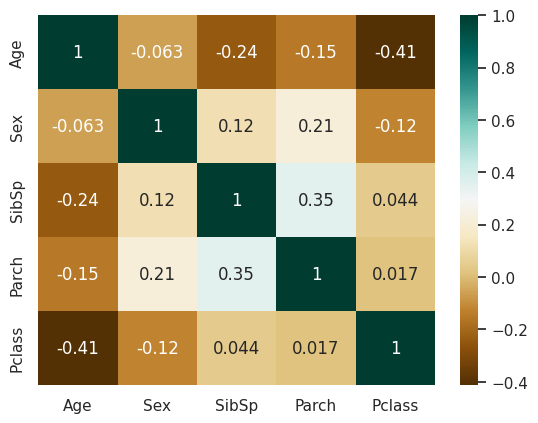
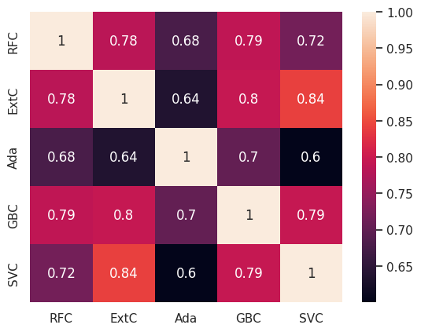
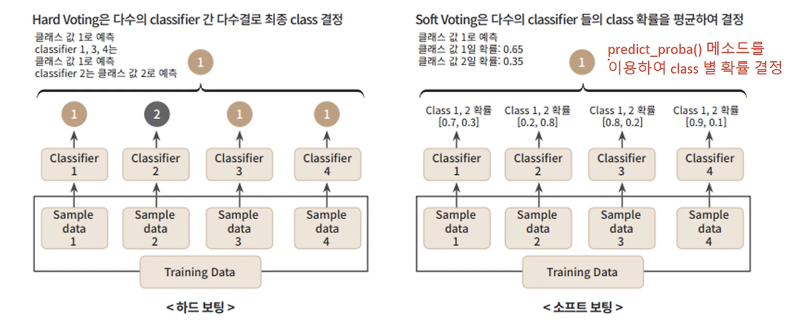

# 1주차 타이타닉 캐글 필사

## 참고 노트북

[Titanic Top 4% with ensemble modeling - Yassine Ghouzam](https://www.kaggle.com/code/yassineghouzam/titanic-top-4-with-ensemble-modeling/notebook)


## 내용 정리

### 이상치 처리
- 2개 이상 이상치를 가진 행 제거

```PYTHON
    # select observations containing more than 2 outliers
    outlier_indices = Counter(outlier_indices)        
    multiple_outliers = list( k for k, v in outlier_indices.items() if v > n )
    
    return multiple_outliers   

# detect outliers from Age, SibSp , Parch and Fare
Outliers_to_drop = detect_outliers(train,2,["Age","SibSp","Parch","Fare"])
```

---
### 결측치 처리
- `Pclass`, `SibSp`, `Parch` 기준 median으로 예측하여 채움



=> 상관계수표에서 `Age`와 상관관계가 상대적으로 높은 컬럼들을 중심으로 결측치를 보완

```PYTHON
# Filling missing value of Age 

## Fill Age with the median age of similar rows according to Pclass, Parch and SibSp
# Index of NaN age rows
index_NaN_age = list(dataset["Age"][dataset["Age"].isnull()].index)

for i in index_NaN_age :
    age_med = dataset["Age"].median()
    age_pred = dataset["Age"][((dataset['SibSp'] == dataset.iloc[i]["SibSp"]) & (dataset['Parch'] == dataset.iloc[i]["Parch"]) & (dataset['Pclass'] == dataset.iloc[i]["Pclass"]))].median()
    if not np.isnan(age_pred) :
        dataset['Age'].iloc[i] = age_pred
    else :
        dataset['Age'].iloc[i] = age_med
```

---
### 데이터 처리
- 가족 크기를 4가지 범주(`Single`, `SmallF`, `MedF`, `LargeF`)로 나눈 범주화 작업

```PYTHON
dataset['Single'] = dataset['Fsize'].map(lambda s: 1 if s == 1 else 0)
dataset['SmallF'] = dataset['Fsize'].map(lambda s: 1 if s == 2 else 0)
dataset['MedF'] = dataset['Fsize'].map(lambda s: 1 if 3 <= s <= 4 else 0)
dataset['LargeF'] = dataset['Fsize'].map(lambda s: 1 if s >=5 else 0)
```

---
### 모델링

#### 교차검증을 통한 분류 모델 성능 평가

```PYTHON
# Cross validate model with Kfold stratified cross val
kfold = StratifiedKFold(n_splits=10)

# Modeling step Test differents algorithms 
random_state = 2
classifiers = []
classifiers.append(SVC(random_state=random_state))
classifiers.append(DecisionTreeClassifier(random_state=random_state))
classifiers.append(AdaBoostClassifier(DecisionTreeClassifier(random_state=random_state),random_state=random_state,learning_rate=0.1))
classifiers.append(RandomForestClassifier(random_state=random_state))
classifiers.append(ExtraTreesClassifier(random_state=random_state))
classifiers.append(GradientBoostingClassifier(random_state=random_state))
classifiers.append(MLPClassifier(random_state=random_state))
classifiers.append(KNeighborsClassifier())
classifiers.append(LogisticRegression(random_state = random_state))
classifiers.append(LinearDiscriminantAnalysis())

cv_results = []
for classifier in classifiers :
    cv_results.append(cross_val_score(classifier, X_train, y = Y_train, scoring = "accuracy", cv = kfold, n_jobs=4))

cv_means = []
cv_std = []
for cv_result in cv_results:
    cv_means.append(cv_result.mean())
    cv_std.append(cv_result.std())

cv_res = pd.DataFrame({"CrossValMeans":cv_means,"CrossValerrors": cv_std,"Algorithm":["SVC","DecisionTree","AdaBoost",
"RandomForest","ExtraTrees","GradientBoosting","MultipleLayerPerceptron","KNeighboors","LogisticRegression","LinearDiscriminantAnalysis"]})

g = sns.barplot("CrossValMeans","Algorithm",data = cv_res, palette="Set3",orient = "h",**{'xerr':cv_std})
g.set_xlabel("Mean Accuracy")
g = g.set_title("Cross validation scores")
```

- 여러 개의 분류 모델을 **StratifiedKFold 교차검증**을 통해 비교 평가함
- 교차검증을 통해 각 모델의 평균 정확도를 계산하여 비교함

#### 하이퍼파라미터 최적화

```PYTHON
### META MODELING  WITH ADABOOST, RF, EXTRATREES and GRADIENTBOOSTING

# Adaboost
DTC = DecisionTreeClassifier()

adaDTC = AdaBoostClassifier(DTC, random_state=7)

ada_param_grid = {"base_estimator__criterion" : ["gini", "entropy"],
              "base_estimator__splitter" :   ["best", "random"],
              "algorithm" : ["SAMME","SAMME.R"],
              "n_estimators" :[1,2],
              "learning_rate":  [0.0001, 0.001, 0.01, 0.1, 0.2, 0.3,1.5]}

gsadaDTC = GridSearchCV(adaDTC,param_grid = ada_param_grid, cv=kfold, scoring="accuracy", n_jobs= 4, verbose = 1)

gsadaDTC.fit(X_train,Y_train)

ada_best = gsadaDTC.best_estimator_

gsadaDTC.best_score_
```

- 선택된 분류 모델에 대해 **GridSearchCV**를 사용하여 최적 하이퍼파라미터를 찾음
    - 사용자가 지정한 모든 하이퍼파라미터 조합을 탐색하여, 최적의 파라미터 조합을 찾아줌

        | 파라미터    | 설명                                     | 예시                                         |
        |-------------|------------------------------------------|----------------------------------------------|
        | estimator   | 사용할 모델                              | `RandomForestClassifier()`                   |
        | param_grid  | 탐색할 하이퍼파라미터의 값 범위          | `{'max_depth': [5, 10], 'n_estimators':[100,200]}` |
        | scoring     | 성능 평가 기준(정확도, 정밀도 등)        | `"accuracy"`                                 |
        | cv          | 교차검증 폴드 수                         | `5` (5-fold 교차검증)                        |
        | n_jobs      | 병렬 처리에 사용할 CPU 코어 수           | `-1` (모든 CPU 사용)                         |
        | verbose     | 진행 상황 출력 (0: 안함, 1: 간단, 2: 상세)| `verbose=1`                                  |

#### 학습 곡선 분석

```PYTHON
def plot_learning_curve(estimator, title, X, y, ylim=None, cv=None,
                        n_jobs=-1, train_sizes=np.linspace(.1, 1.0, 5)):
    """Generate a simple plot of the test and training learning curve"""
    plt.figure()
    plt.title(title)
    if ylim is not None:
        plt.ylim(*ylim)
    plt.xlabel("Training examples")
    plt.ylabel("Score")
    train_sizes, train_scores, test_scores = learning_curve(
        estimator, X, y, cv=cv, n_jobs=n_jobs, train_sizes=train_sizes)
    train_scores_mean = np.mean(train_scores, axis=1)
    train_scores_std = np.std(train_scores, axis=1)
    test_scores_mean = np.mean(test_scores, axis=1)
    test_scores_std = np.std(test_scores, axis=1)
    plt.grid()

    plt.fill_between(train_sizes, train_scores_mean - train_scores_std,
                     train_scores_mean + train_scores_std, alpha=0.1,
                     color="r")
    plt.fill_between(train_sizes, test_scores_mean - test_scores_std,
                     test_scores_mean + test_scores_std, alpha=0.1, color="g")
    plt.plot(train_sizes, train_scores_mean, 'o-', color="r",
             label="Training score")
    plt.plot(train_sizes, test_scores_mean, 'o-', color="g",
             label="Cross-validation score")

    plt.legend(loc="best")
    return plt

g = plot_learning_curve(gsRFC.best_estimator_,"RF mearning curves",X_train,Y_train,cv=kfold)
g = plot_learning_curve(gsExtC.best_estimator_,"ExtraTrees learning curves",X_train,Y_train,cv=kfold)
g = plot_learning_curve(gsSVMC.best_estimator_,"SVC learning curves",X_train,Y_train,cv=kfold)
g = plot_learning_curve(gsadaDTC.best_estimator_,"AdaBoost learning curves",X_train,Y_train,cv=kfold)
g = plot_learning_curve(gsGBC.best_estimator_,"GradientBoosting learning curves",X_train,Y_train,cv=kfold)
```

- 학습 곡선을 통해 과적합 여부와 훈련 데이터 크기에 따른 정확도 변화를 시각적으로 분석함

#### 특성 중요도 분석

```PYTHON
nrows = ncols = 2
fig, axes = plt.subplots(nrows = nrows, ncols = ncols, sharex="all", figsize=(15,15))

names_classifiers = [("AdaBoosting", ada_best),("ExtraTrees",ExtC_best),("RandomForest",RFC_best),("GradientBoosting",GBC_best)]

nclassifier = 0
for row in range(nrows):
    for col in range(ncols):
        name = names_classifiers[nclassifier][0]
        classifier = names_classifiers[nclassifier][1]
        indices = np.argsort(classifier.feature_importances_)[::-1][:40]
        g = sns.barplot(y=X_train.columns[indices][:40],x = classifier.feature_importances_[indices][:40] , orient='h',ax=axes[row][col])
        g.set_xlabel("Relative importance",fontsize=12)
        g.set_ylabel("Features",fontsize=12)
        g.tick_params(labelsize=9)
        g.set_title(name + " feature importance")
        nclassifier += 1
```

- 트리 기반 모델의 주요 특성 중요도를 분석함

#### 앙상블 모델링



- 각 모델들이 얼마나 비슷한 예측을 하는지 파악할 수 있음
- 서로 다른 예측 경향을 가진 모델을 찾으면 앙상블 효과를 극대화할 수 있음
=> AdaBoost는 다른 모델들과 상관관계가 낮아 다양성을 높이는 데 유리

```PYTHON
votingC = VotingClassifier(estimators=[('rfc', RFC_best), ('extc', ExtC_best),
('svc', SVMC_best), ('adac',ada_best),('gbc',GBC_best)], voting='soft', n_jobs=4)

votingC = votingC.fit(X_train, Y_train)
```

- 여러 개의 개별 모델을 결합하여 더 높은 성능을 얻는 모델링 방법

    > **투표 기반 분류기(Voting Classifier):**<br>
    > 여러 모델의 예측을 조합하여 최종 결정을 내리는 방식
     
    | 유형          | 설명                                                           |
    |---------------|----------------------------------------------------------------|
    | **Hard Voting** | 개별 모델들이 예측한 결과(클래스)에서 가장 많이 투표된 클래스 선택     |
    | **Soft Voting** | 개별 모델들의 클래스별 예측 확률을 평균낸 후 가장 높은 확률의 클래스 선택 |

    

    => **Soft Voting** 방식은 각 모델이 반환하는 클래스에 대한 예측 확률을 활용하여, 더욱 정밀하고 일반화된 결과를 얻을 수 있음